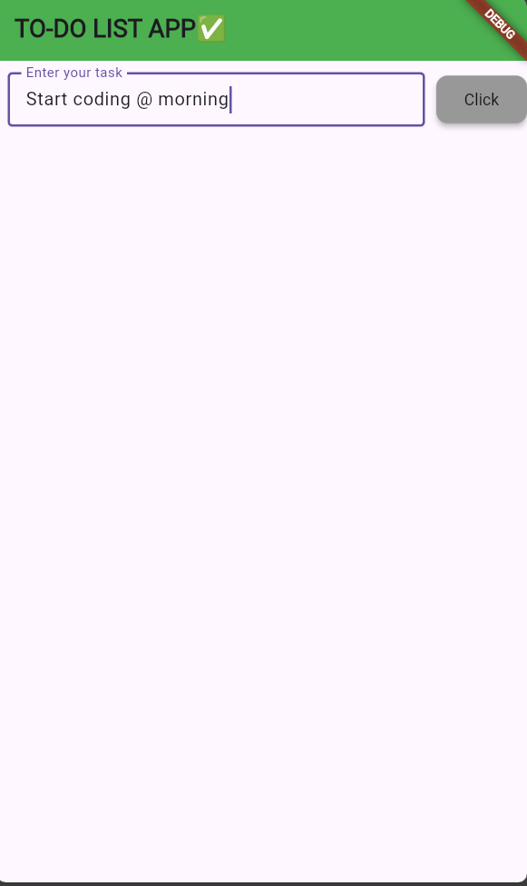
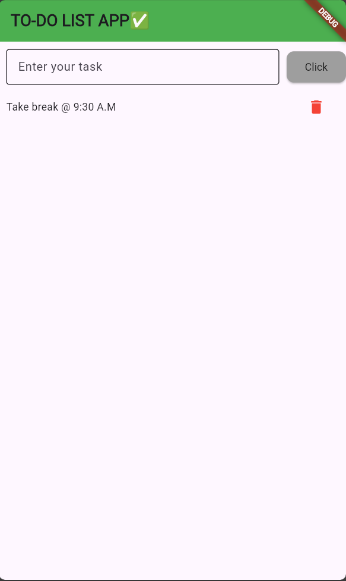

# ✅ Flutter To-Do List App

A simple, clean, and user-friendly **To-Do List application** built using **Flutter**.  
This app helps users **add, view, and delete tasks** easily with a minimal UI.

---

## 📌 1. Project Overview
The Flutter To-Do List App allows users to manage daily tasks efficiently.  
It demonstrates **state management**, **list rendering**, and **user input handling** using Flutter widgets.

---

## ✨ 2. Features
1. ➕ Add new tasks
2. 📝 Display task list dynamically
3. ❌ Delete tasks instantly
4. 📱 Responsive UI
5. 🎨 Clean Material Design
6. ⚡ Real-time UI updates

---

## 🛠️ 3. Technology Stack
1. 🧩 Framework: Flutter  
2. 💻 Language: Dart  
3. 🎨 UI: Material Design  

---

## 📂 4. Project Structure
lib/
└── main.dart

---

## 🚀 5. Setup & Run Instructions

### Step 1️⃣ Clone Repository
    git clone https://github.com/YOUR_USERNAME/to_do_list.git

### Step 2️⃣ Navigate to Project
    cd to_do_list
    
### Step 3️⃣ Install Dependencies
    flutter pub get
    
### Step 3️⃣ Install Dependencies
    flutter pub get

### Step 4️⃣ Run Application
    flutter run
    
---

## ⚙️ 6. Working Principle
1.📥 Tasks are entered using TextField.

2.➕ Tasks are added to a List<String>.

3.🔄 UI updates using setState().

4.📜 Tasks are displayed using ListView.builder.

5.🗑️ Tasks are removed using the delete icon.

---

## 📸 Screenshots

### 🏠 Home Screen

### ➕ Add Task

### 📋 Task List

### 🗑️ Delete Task

---

## 🔮 8. Future Enhancements
-->⏰ Task reminders

-->💾 Local database (Hive / SQLite)

-->☑️ Mark tasks as completed

-->🌙 Dark mode support

-->🗂️ Category-based tasks

---

## 👨‍💻 9. Author
Tamil Selvan S
Flutter Developer

---

📜 10. License

This project is open-source and created for learning and educational purposes.
